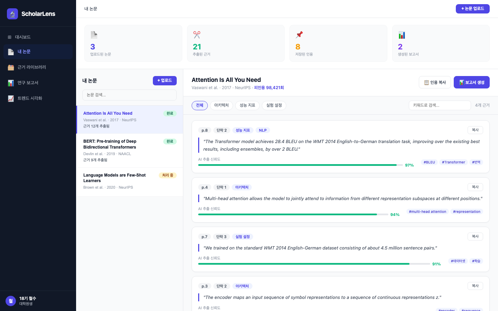

# ScholarLens — UI Prototype

ScholarLens 서비스의 핵심 화면 프로토타입입니다.

## 실행 방법

```bash
cd projects/scholarlens/prototype
npm install
npm run dev
# → http://localhost:5173
```

## 화면 미리보기



## 구현된 화면

### 레이아웃
- **좌측 사이드바** — 전체 네비게이션 (대시보드, 내 논문, 근거 라이브러리, 연구 보고서, 트렌드 시각화) + 사용자 정보
- **상단 통계바** — 업로드 논문 수 / 추출된 근거 수 / 저장된 인용 수 / 생성된 보고서 수
- **논문 리스트 패널** — 논문 검색, 처리 상태(완료/처리 중) 표시
- **근거 문장 패널** — 논문 메타 정보, 태그 필터, 키워드 검색, 근거 카드

### 근거 카드 구성
| 요소 | 설명 |
|------|------|
| 위치 배지 | 페이지 번호 + 단락 번호 |
| 태그 | 아키텍처 / 성능 지표 / 실험 설정 등 |
| 원문 인용 | 이탤릭체 블록 인용 형식 |
| AI 신뢰도 | 프로그레스 바 + 퍼센트 |
| 키워드 해시태그 | AI 추출 관련 키워드 |
| 복사 버튼 | 클릭 시 클립보드 복사 + 피드백 |

### 인터랙션
- 논문 클릭 → 해당 논문의 근거 문장으로 전환
- "처리 중" 논문 클릭 → AI 처리 중 스피너 표시
- 태그 필터 클릭 → 근거 문장 필터링
- 키워드 검색 → 실시간 필터링
- 업로드 버튼 → 드래그앤드롭 모달

## 기술 스택

| 항목 | 내용 |
|------|------|
| 프레임워크 | React 18 |
| 번들러 | Vite |
| 스타일 | 인라인 스타일 (자립형) |
| 의존성 | 없음 (순수 React) |

## 다음 단계

이 프로토타입은 `app/` 디렉토리의 실제 Next.js 서비스 구현 전 UX를 검증하기 위한 목적입니다.

- [ ] 실제 PDF 업로드 + AI 파이프라인 연결
- [ ] `app/src/components/` 로 컴포넌트 분리
- [ ] Tailwind CSS + shadcn/ui 로 스타일 전환
- [ ] DB 연동 (Prisma + PostgreSQL)
